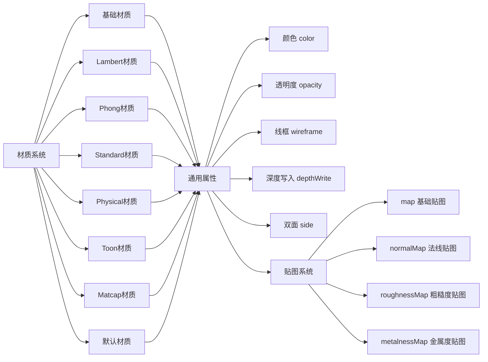
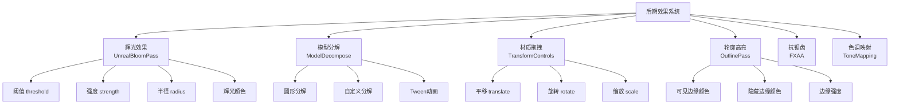
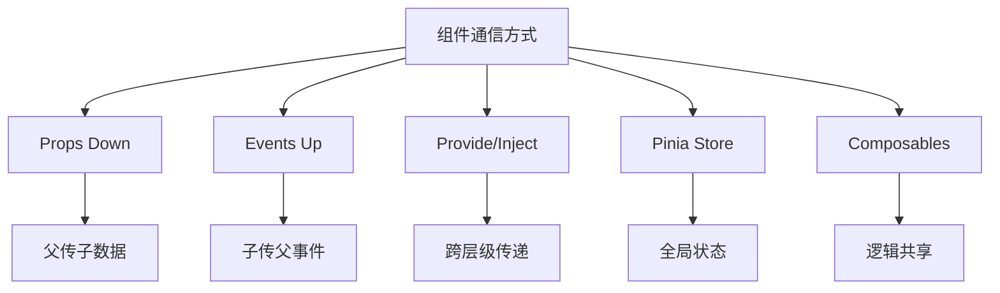

# 功能清单与模块设计详细文档

## 📋 完整功能清单

### 1. 模型管理功能 (Model Management)

#### 1.1 模型加载

| 功能点 | 支持格式 | 关键技术 | Composable | Store |
| --- | --- | --- | --- | --- |
| 单模型加载 | GLB, GLTF, FBX, OBJ, STL | GLTFLoader, DRACOLoader | `useModelLoader` | `sceneStore` |
| 多模型加载 | 同上 | 拖拽 + Raycaster | `useMultiModelLoader` | `multiModelStore` |
| 外部模型上传 | 同上 | FileReader, URL.createObjectURL | `useModelUpload` | `sceneStore` |
| 模型进度条 | - | LoadingManager | `useLoadingProgress` | `editorStore` |
| 模型缓存 | - | IndexedDB | `useModelCache` | - |

#### 1.2 模型操作

| 功能点   | 描述                  | Composable         | API方法          |
| -------- | --------------------- | ------------------ | ---------------- |
| 模型切换 | 在单/多模型模式间切换 | `useModelSwitcher` | `switchModel()`  |
| 模型选择 | 点击选择模型/材质     | `useSelection`     | `selectObject()` |
| 模型删除 | 删除场景中的模型      | `useModelManager`  | `deleteModel()`  |
| 模型复制 | 克隆模型到场景        | `useModelCloner`   | `cloneModel()`   |
| 模型导出 | 导出为GLB/GLTF/USDZ   | `useModelExporter` | `exportModel()`  |

### 2. 拖拽系统功能 (Drag & Drop System)

#### 2.1 拖拽类型矩阵

```mermaid
graph TB
    A[拖拽系统]

    A --> B1[模型拖拽]
    A --> B2[几何体拖拽]
    A --> B3[标签拖拽]
    A --> B4[着色器拖拽]
    A --> B5[模型库拖拽]

    B1 --> C1[触发条件:多模型模式]
    B1 --> C2[拖拽源:模型列表]
    B1 --> C3[放置目标:3D场景]
    B1 --> C4[位置计算:Raycaster]
    B1 --> C5[结果:添加到场景]

    B2 --> D1[触发条件:几何体模式]
    B2 --> D2[拖拽源:几何体列表]
    B2 --> D3[放置目标:3D场景]
    B2 --> D4[位置计算:Raycaster]
    B2 --> D5[结果:创建几何体]

    B3 --> E1[触发条件:标签模式]
    B3 --> E2[拖拽源:标签图标]
    B3 --> E3[放置目标:3D场景]
    B3 --> E4[位置计算:Raycaster]
    B3 --> E5[结果:创建CSS3D标签]

    B4 --> F1[触发条件:着色器模式]
    B4 --> F2[拖拽源:着色器列表]
    B4 --> F3[放置目标:3D场景]
    B4 --> F4[位置计算:Raycaster]
    B4 --> F5[结果:创建着色器网格]

    B5 --> G1[触发条件:模型库页面]
    B5 --> G2[拖拽源:模型卡片]
    B5 --> G3[放置目标:布局容器]
    B5 --> G4[位置计算:容器坐标]
    B5 --> G5[结果:调整布局]
```



#### 2.2 拖拽完整API

| Composable | 方法 | 参数 | 返回值 | 说明 |
| --- | --- | --- | --- | --- |
| `useDragCore` | `startDrag` | (item, type, event) | void | 开始拖拽 |
|  | `onDrag` | (event) | void | 拖拽中 |
|  | `endDrag` | (event) | void | 拖拽结束 |
|  | `onDrop` | (event) | void | 放置 |
| `useModelDrag` | `startModelDrag` | (model, event) | void | 开始拖拽模型 |
|  | `handleModelDrop` | (model, position) | Promise\<void\> | 处理模型放置 |
| `useGeometryDrag` | `startGeometryDrag` | (geometry, event) | void | 开始拖拽几何体 |
|  | `createGeometry` | (type, params) | THREE.Mesh | 创建几何体 |
| `useTagDrag` | `startTagDrag` | (tag, event) | void | 开始拖拽标签 |
|  | `createTag` | (tag, position) | CSS3DObject | 创建3D标签 |

### 3. 材质系统功能

#### 3.1 材质类型支持



#### 3.2 材质功能API

```typescript
// 材质编辑器完整API
interface MaterialEditorAPI {
  // 基础操作
  selectMaterial(material: Material): void;
  deselectMaterial(): void;

  // 属性编辑
  updateColor(color: number): void;
  updateOpacity(opacity: number): void;
  updateWireframe(enabled: boolean): void;
  updateDepthWrite(enabled: boolean): void;

  // 类型切换
  changeMaterialType(type: MaterialType): void;

  // 贴图管理
  loadTexture(url: string, type: TextureType): Promise<void>;
  removeTexture(type: TextureType): void;

  // 批量操作
  applyToAll(config: Partial<MaterialConfig>): void;
  resetAll(): void;

  // 状态查询
  getMaterialList(): Material[];
  getSelectedMaterial(): Material | null;
  getMaterialConfig(): MaterialConfig;
}
```

### 4. 灯光系统功能

#### 4.1 灯光类型完整配置

| 灯光类型   | 属性       | 默认值               | 范围   | 说明     |
| ---------- | ---------- | -------------------- | ------ | -------- |
| **环境光** | color      | #ffffff              | -      | 颜色     |
|            | intensity  | 0.8                  | 0-5    | 强度     |
| **平行光** | color      | #1E90FF              | -      | 颜色     |
|            | intensity  | 1                    | 0-10   | 强度     |
|            | position   | (-1.26, -3.85, 2.98) | -      | 位置     |
|            | castShadow | true                 | -      | 投射阴影 |
|            | helper     | true                 | -      | 辅助线   |
| **点光源** | color      | #1E90FF              | -      | 颜色     |
|            | intensity  | 1                    | 0-10   | 强度     |
|            | distance   | 2.53                 | 0-100  | 照射距离 |
|            | position   | (-4.21, -4.1, 2.53)  | -      | 位置     |
| **聚光灯** | color      | #323636              | -      | 颜色     |
|            | intensity  | 400                  | 0-1000 | 强度     |
|            | angle      | 0.5                  | 0-π/2  | 照射角度 |
|            | penumbra   | 1                    | 0-1    | 半影衰减 |
|            | distance   | 20                   | 0-100  | 照射距离 |
|            | castShadow | true                 | -      | 投射阴影 |

### 5. 后期效果功能

#### 5.1 效果列表



### 6. 着色器系统功能

#### 6.1 预设着色器清单

| 着色器名称 | 类型 | 用途 | uniform参数 | 更新方式 |
| --- | --- | --- | --- | --- |
| **警告着色器** | 平面 | 警告提示区域 | uTime, uColor, uSpeed | 每帧更新uTime |
| **罗盘着色器** | 平面 | 导航指示 | iTime, iResolution | 每帧更新iTime |
| **雷达着色器** | 平面 | 扫描效果 | iTime, iResolution | 每帧更新iTime |
| **光圈着色器** | 平面 | 收缩光圈效果 | uTime, uColor, uRadius | 每帧更新uTime |
| **墙体着色器** | 平面 | 流动墙体效果 | uTime | 每帧更新uTime |
| **闪烁警告** | 平面 | 闪烁警告效果 | uTime, uPulse | 每帧更新uTime |
| **圆圈围栏** | 管状 | 围栏效果 | uMax, uMin, uColor | 缩放动画 |

#### 6.2 着色器优化策略

```typescript
/**
 * 着色器缓存优化
 *
 * 原架构: 每帧遍历整个场景更新着色器
 * 新架构: 使用Map缓存，只更新注册的着色器
 */

// ✅ 优化后的实现
export function useShaderCache() {
  const cache = new Map<string, ShaderCacheItem>();

  const register = (uuid: string, shader: ShaderMesh) => {
    cache.set(uuid, {
      mesh: shader,
      updateType: getUpdateType(shader.userData.shaderType),
    });
  };

  const updateAll = (clock: THREE.Clock) => {
    for (const [uuid, item] of cache) {
      if (!item.mesh.parent) {
        cache.delete(uuid);
        continue;
      }

      switch (item.updateType) {
        case 'uTime':
          item.mesh.material.uniforms.uTime.value = clock.getElapsedTime();
          break;
        case 'iTime':
          item.mesh.material.uniforms.iTime.value += 0.01;
          break;
        case 'scale':
          updateScaleAnimation(item.mesh);
          break;
      }
    }
  };

  return { register, updateAll, cache };
}
```

---

## 🎯 模块设计详解

### 1. 核心Composables清单

#### 1.1 Three.js核心模块 (10个)

```typescript
// composables/core/three/
export interface ThreeCoreComposables {
  useThreeScene: () => SceneAPI;
  useThreeRenderer: () => RendererAPI;
  useThreeCamera: () => CameraAPI;
  useThreeControls: () => ControlsAPI;
  useThreeLoader: () => LoaderAPI;
  useThreeRaycaster: () => RaycasterAPI;
  useThreeHelper: () => HelperAPI;
  useThreeMath: () => MathAPI;
  useThreeTraverse: () => TraverseAPI;
  useThreeDispose: () => DisposeAPI;
}
```

#### 1.2 编辑器功能模块 (30+个)

```typescript
// composables/editor/
export interface EditorComposables {
  // 材质系统 (6个)
  useMaterialEditor: () => MaterialEditorAPI;
  useMaterialTypes: () => MaterialTypesAPI;
  useMaterialTexture: () => MaterialTextureAPI;
  useMaterialSelection: () => MaterialSelectionAPI;
  useMaterialBatch: () => MaterialBatchAPI;
  useMaterialPresets: () => MaterialPresetsAPI;

  // 灯光系统 (7个)
  useLightEditor: () => LightEditorAPI;
  useAmbientLight: () => AmbientLightAPI;
  useDirectionalLight: () => DirectionalLightAPI;
  usePointLight: () => PointLightAPI;
  useSpotLight: () => SpotLightAPI;
  useLightHelper: () => LightHelperAPI;
  useLightPresets: () => LightPresetsAPI;

  // 动画系统 (5个)
  useAnimationPlayer: () => AnimationPlayerAPI;
  useAnimationMixer: () => AnimationMixerAPI;
  useAnimationClip: () => AnimationClipAPI;
  useModelRotation: () => ModelRotationAPI;
  useAnimationPresets: () => AnimationPresetsAPI;

  // 背景系统 (7个)
  useBackgroundEditor: () => BackgroundEditorAPI;
  useBackgroundColor: () => BackgroundColorAPI;
  useBackgroundImage: () => BackgroundImageAPI;
  useBackgroundPanorama: () => BackgroundPanoramaAPI;
  useBackgroundHDR: () => BackgroundHDRAPI;
  useBackgroundVideo: () => BackgroundVideoAPI;
  useBackgroundPresets: () => BackgroundPresetsAPI;

  // 其他系统...
}
```

#### 1.3 拖拽系统模块 (15个)

```typescript
// composables/drag/
export interface DragComposables {
  // 核心 (4个)
  useDragCore: () => DragCoreAPI;
  useDragState: () => DragStateAPI;
  useDragEvents: () => DragEventsAPI;
  useDragLifecycle: () => DragLifecycleAPI;

  // 类型 (5个)
  useModelDrag: () => ModelDragAPI;
  useGeometryDrag: () => GeometryDragAPI;
  useTagDrag: () => TagDragAPI;
  useShaderDrag: () => ShaderDragAPI;
  useLibraryDrag: () => LibraryDragAPI;

  // 工具 (6个)
  useDragPosition: () => DragPositionAPI;
  useRaycast: () => RaycastAPI;
  useDragConstraints: () => DragConstraintsAPI;
  useDragValidation: () => DragValidationAPI;
  useDragAnimation: () => DragAnimationAPI;
  useDragSnapshot: () => DragSnapshotAPI;
}
```

---

## 📊 状态管理设计

### Pinia Store 完整清单

#### 核心Stores (15个)

```typescript
// stores/modules/
export interface StoreModules {
  // 编辑器核心
  editorStore: EditorState;
  sceneStore: SceneState;
  selectionStore: SelectionState;
  historyStore: HistoryState;
  settingsStore: SettingsState;

  // 拖拽系统
  dragStore: DragState;

  // 模型管理
  multiModelStore: MultiModelState;
  geometryStore: GeometryState;

  // 功能模块
  materialStore: MaterialState;
  lightStore: LightState;
  animationStore: AnimationState;
  backgroundStore: BackgroundState;
  effectStore: EffectState;
  tagStore: TagState;
  shaderStore: ShaderState;
}
```

### Store 状态结构示例

```typescript
// stores/modules/editor.ts
export interface EditorState {
  // 编辑器模式
  mode: EditorMode; // 'edit' | 'preview' | 'multiModel' | 'geometry' | 'tag' | 'shader'

  // 加载状态
  loading: boolean;
  loadingProgress: number;

  // 选中对象
  selectedObject: THREE.Object3D | null;
  selectedMaterial: THREE.Material | null;

  // 编辑器配置
  config: EditorConfig;

  // UI状态
  panelVisible: boolean;
  activePanel: PanelType;
  toolbarVisible: boolean;

  // 视口状态
  viewportSize: { width: number; height: number };
  fullscreen: boolean;

  // 性能监控
  fps: number;
  renderTime: number;
}
```

---

## 🎨 组件设计规范

### 组件分类

| 分类          | 命名规范     | 职责         | 示例            |
| ------------- | ------------ | ------------ | --------------- |
| **布局组件**  | XxxLayout    | 页面布局     | `EditorLayout`  |
| **页面组件**  | XxxView      | 路由页面     | `EditorView`    |
| **业务组件**  | XxxPanel/Xxx | 业务逻辑     | `MaterialPanel` |
| **通用组件**  | Base/Common  | 纯展示       | `BaseButton`    |
| **Three组件** | ThreeXxx     | Three.js封装 | `ThreeCanvas`   |

### 组件通信方式



---

## 📝 完整功能统计

### 功能点统计表

| 模块           | 功能点数量 | Composables数量 | Stores数量 | 复杂度     |
| -------------- | ---------- | --------------- | ---------- | ---------- |
| **模型管理**   | 15         | 8               | 2          | ⭐⭐⭐     |
| **拖拽系统**   | 25         | 15              | 1          | ⭐⭐⭐⭐⭐ |
| **材质系统**   | 20         | 6               | 1          | ⭐⭐⭐⭐   |
| **灯光系统**   | 16         | 7               | 1          | ⭐⭐⭐     |
| **动画系统**   | 12         | 5               | 1          | ⭐⭐⭐     |
| **背景系统**   | 10         | 7               | 1          | ⭐⭐⭐     |
| **后期效果**   | 18         | 6               | 1          | ⭐⭐⭐⭐⭐ |
| **几何体系统** | 8          | 3               | 1          | ⭐⭐⭐     |
| **标签系统**   | 10         | 3               | 1          | ⭐⭐⭐⭐   |
| **着色器系统** | 14         | 8               | 1          | ⭐⭐⭐⭐⭐ |
| **交互系统**   | 20         | 10              | 2          | ⭐⭐⭐⭐   |
| **导出系统**   | 8          | 6               | 0          | ⭐⭐⭐     |
| **合计**       | **176**    | **84**          | **13**     | -          |

---

## 🔥 热点功能深度设计

### 射线检测系统

```typescript
// composables/drag/utils/useRaycast.ts
export function useRaycast() {
  const raycaster = new THREE.Raycaster();
  const mouse = new THREE.Vector2();

  /**
   * 获取鼠标位置的3D交点
   */
  const getIntersection = (
    position: { x: number; y: number },
    scene: THREE.Scene,
    camera: THREE.Camera,
    container?: HTMLElement,
  ): THREE.Intersection | null => {
    const rect = container?.getBoundingClientRect() ?? {
      left: 0,
      top: 0,
      width: window.innerWidth,
      height: window.innerHeight,
    };

    // 转换为标准化设备坐标
    mouse.x = ((position.x - rect.left) / rect.width) * 2 - 1;
    mouse.y = -((position.y - rect.top) / rect.height) * 2 + 1;

    // 射线检测
    raycaster.setFromCamera(mouse, camera);
    const intersects = raycaster.intersectObjects(scene.children, true);

    // 过滤有效对象
    const validIntersects = intersects.filter(
      (item) => item.object.isMesh && item.object.material,
    );

    return validIntersects[0] || null;
  };

  return {
    raycaster,
    mouse,
    getIntersection,
  };
}
```

---

## 🎯 总结

本文档提供了:

- ✅ 完整的功能清单 (176个功能点)
- ✅ 详细的模块设计 (84个Composables)
- ✅ 完整的API定义
- ✅ 优化策略说明

**配合主文档和其他文档使用，可以获得完整的架构视图！**
