# 架构可视化图谱

> **文档说明**: 这是一份完整的架构可视化文档，通过图表直观展示整个系统架构

## 📋 目录

- [系统全景图](#系统全景图)
- [核心架构图](#核心架构图)
- [拖拽系统图](#拖拽系统图)
- [数据流图](#数据流图)
- [模块依赖图](#模块依赖图)
- [状态管理图](#状态管理图)
- [交互流程图](#交互流程图)

---

## 🌍 系统全景图

### 完整系统架构

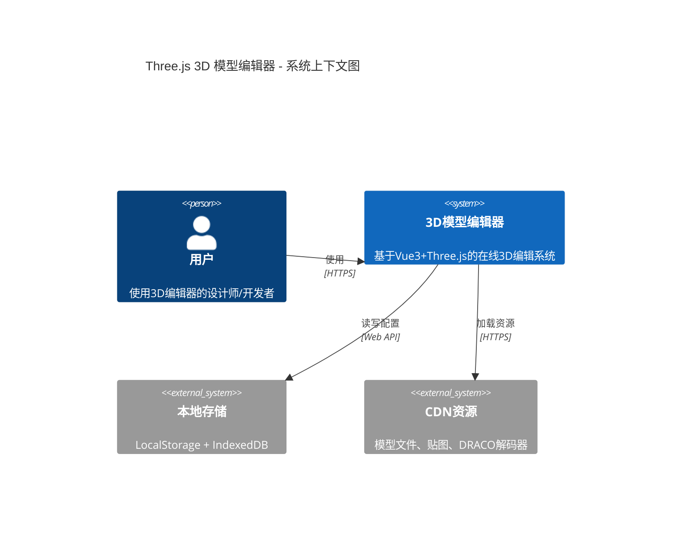

### 六层架构全景

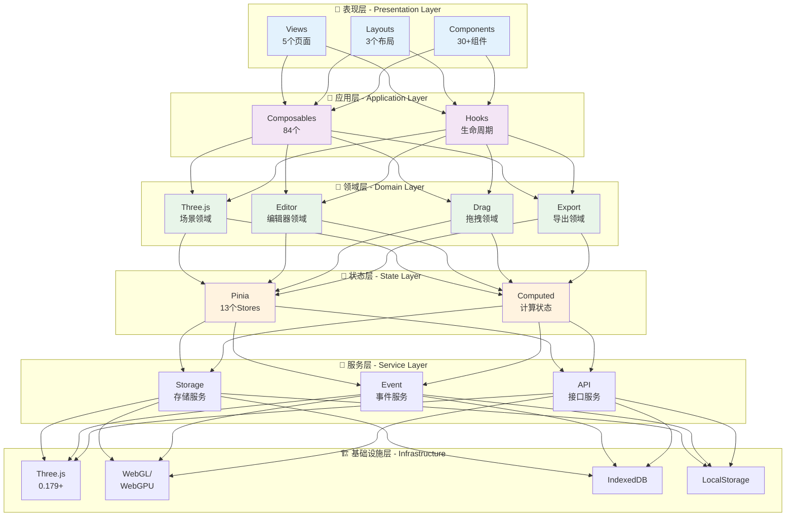

---

## 🎯 核心架构图

### 1. Composables 生态系统

```mermaid
graph TB
    subgraph "Core - 核心层 (13个)"
        C1[useThreeScene]
        C2[useThreeRenderer]
        C3[useThreeCamera]
        C4[useThreeControls]
        C5[useThreeLoader]
        C6[useThreeRaycaster]
        C7[useRenderLoop]
        C8[useEffectComposer]
        C9[useCSS3DRenderer]
        C10[useSceneLifecycle]
        C11[useResourceCleanup]
        C12[useThreeHelper]
        C13[useThreeMath]
    end

    subgraph "Editor - 编辑器层 (40个)"
        E1[Material System<br/>6个Composables]
        E2[Light System<br/>7个Composables]
        E3[Animation System<br/>5个Composables]
        E4[Background System<br/>7个Composables]
        E5[Effect System<br/>6个Composables]
        E6[Geometry System<br/>3个Composables]
        E7[Tag System<br/>3个Composables]
        E8[Shader System<br/>8个Composables]
        E9[Helper System<br/>3个Composables]
        E10[Transform System<br/>3个Composables]
    end

    subgraph "Drag - 拖拽层 (15个)"
        DR1[Core<br/>4个]
        DR2[Types<br/>5个]
        DR3[Utils<br/>6个]
    end

    subgraph "Interaction - 交互层 (10个)"
        I1[Selection<br/>3个]
        I2[Menu<br/>2个]
        I3[Keyboard<br/>3个]
        I4[Mouse<br/>3个]
        I5[Screen<br/>2个]
    end

    subgraph "State - 状态层 (5个)"
        ST1[useHistory]
        ST2[useUndo]
        ST3[useRedo]
        ST4[useEditorState]
        ST5[useModelState]
    end

    E1 & E2 & E3 & E4 & E5 --> C1 & C2 & C3
    DR1 & DR2 --> C6
    I1 & I2 & I3 & I4 --> C6
    E1 & E2 & E3 --> ST1

    style C1 fill:#90caf9
    style E1 fill:#a5d6a7
    style DR1 fill:#ffcc80
    style I1 fill:#ce93d8
    style ST1 fill:#fff59d
```

### 2. Pinia Stores 架构

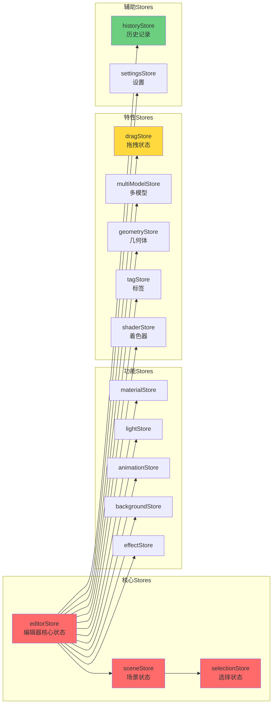

---

## 🖱️ 拖拽系统图

### 1. 拖拽系统完整架构

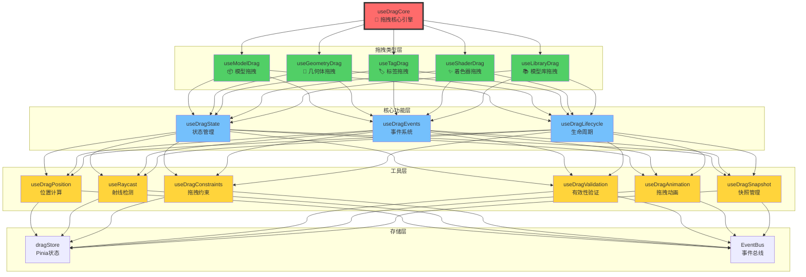

### 2. 五种拖拽类型详细流程

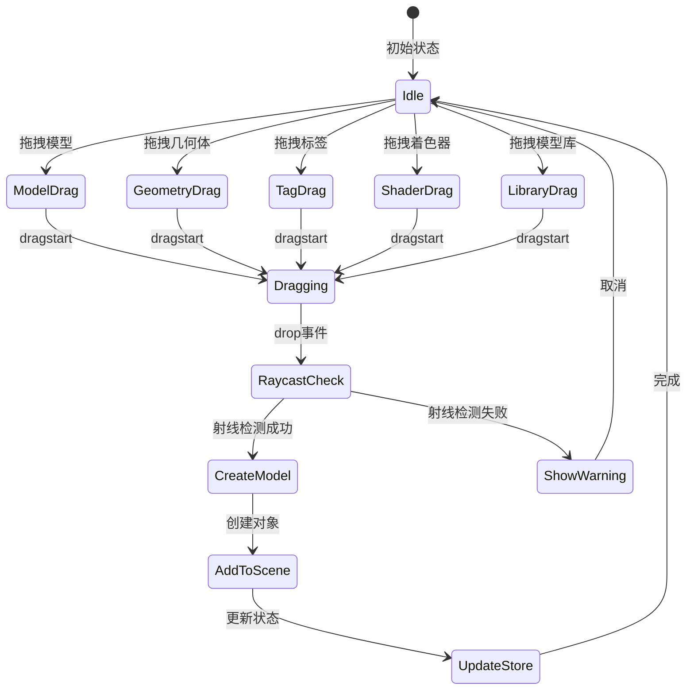

### 3. 拖拽交互时序图

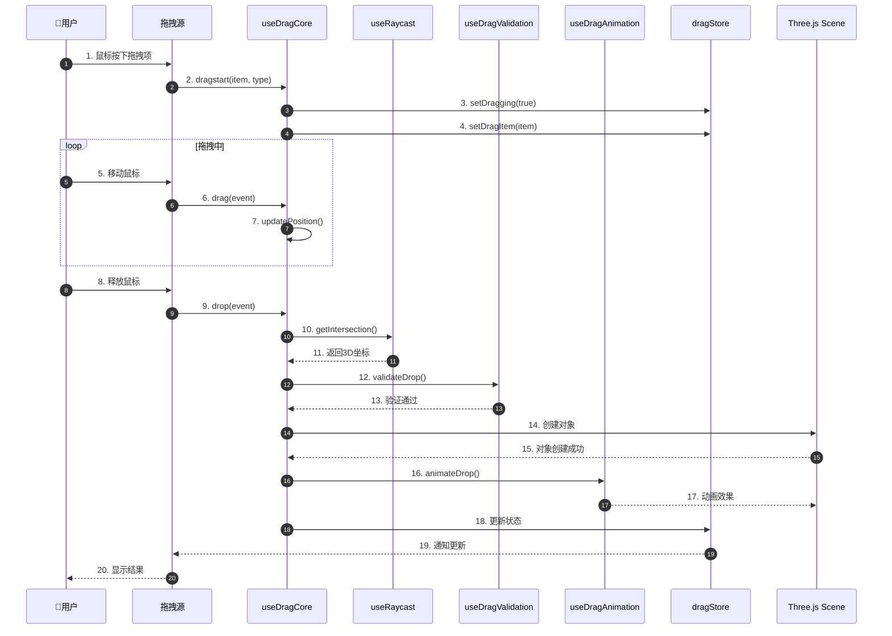

---

## 📊 数据流图

### 1. 完整数据流架构

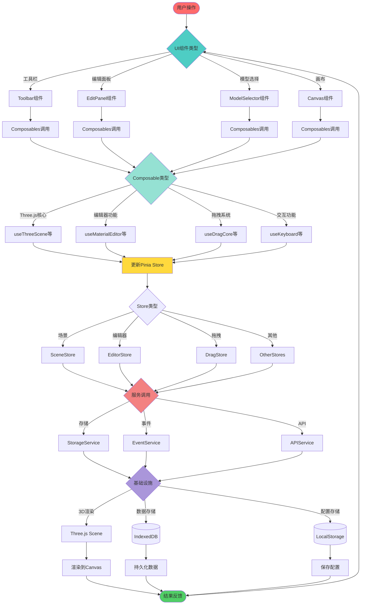

### 2. 状态更新流程

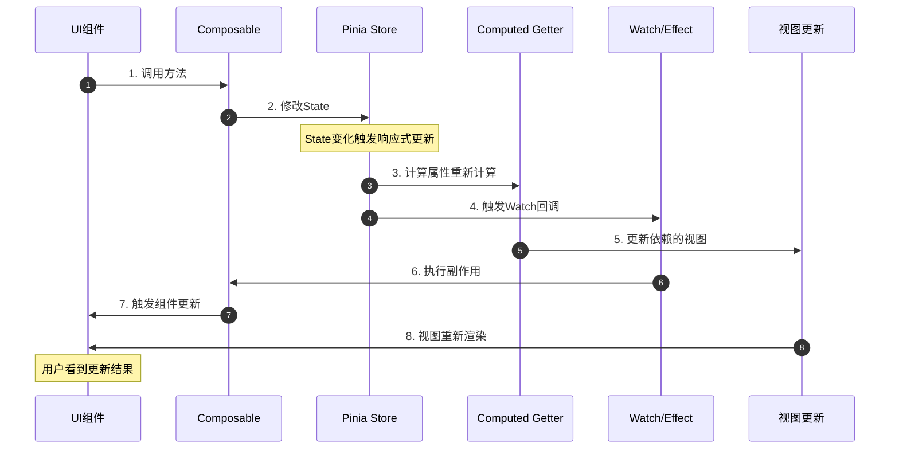

---

## 🎨 模块依赖图

### 1. Composables 依赖关系

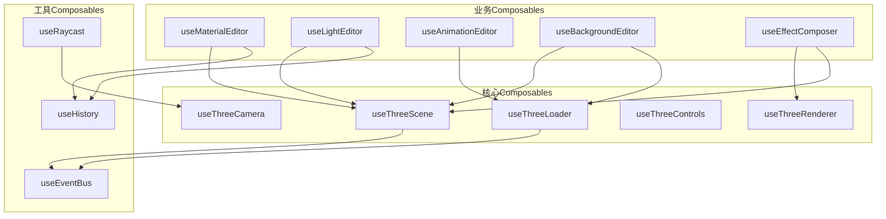

### 2. Store 依赖关系

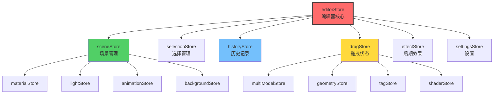

---

## 🎬 交互流程图

### 1. 模型加载完整流程

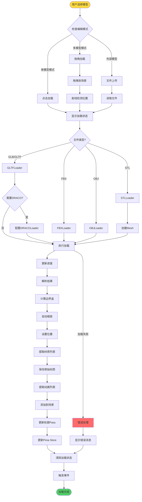

### 2. 材质编辑流程

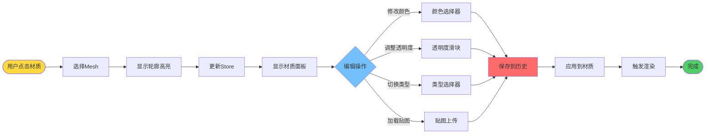

### 3. 辉光效果渲染流程

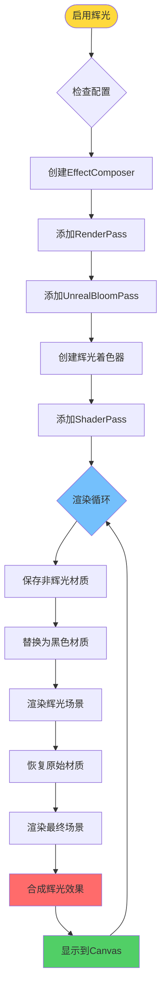

---

## 🏗️ 组件架构图

### 1. 组件层次树

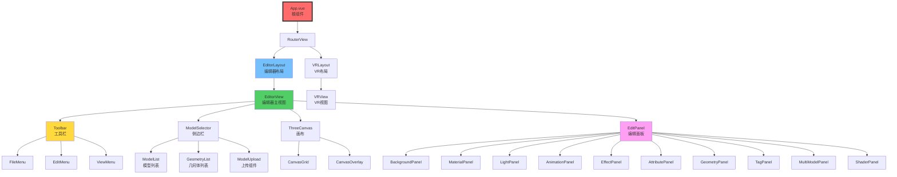

### 2. 编辑面板组件关系

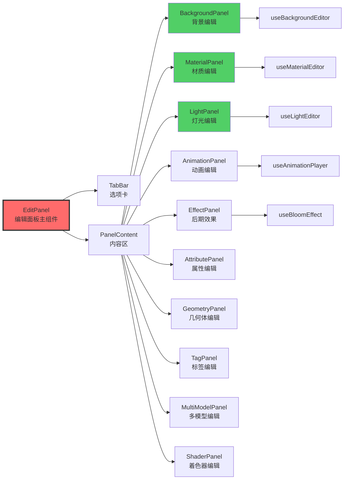

---

## 🔄 状态管理图

### 1. Store 数据流

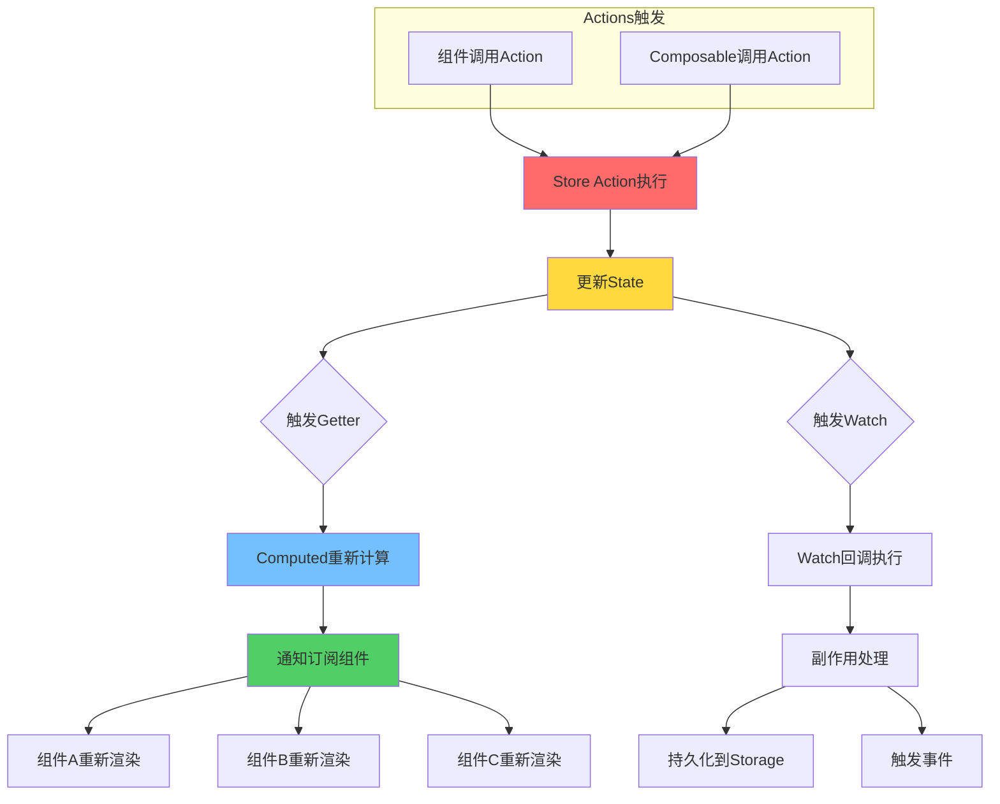

### 2. 历史记录系统

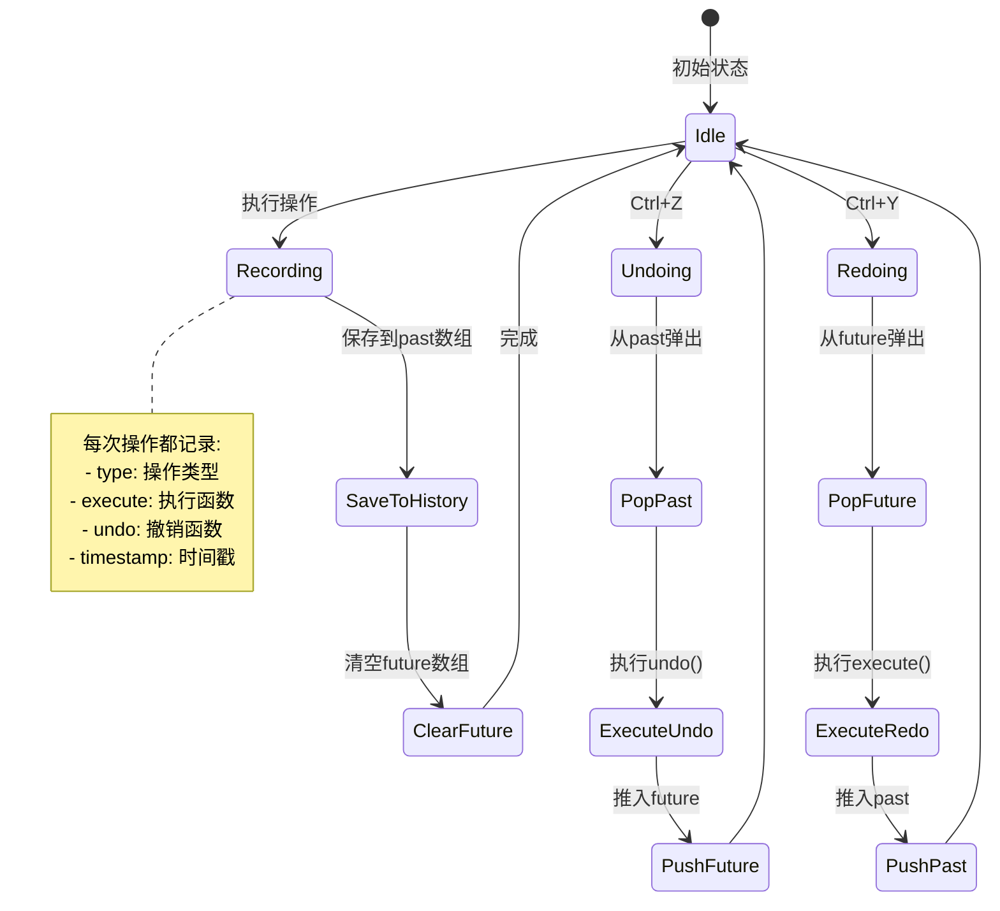

---

## 🎮 Three.js 场景图

### 1. 场景对象层次

```mermaid
graph TB
    Scene[THREE.Scene<br/>根场景]

    Scene --> Model[Model Group<br/>主模型组]
    Scene --> MultiModel[MultiModel Group<br/>多模型组]
    Scene --> Geometry[Geometry Group<br/>几何体组]
    Scene --> Lights[Lights<br/>灯光]
    Scene --> Helpers[Helpers<br/>辅助对象]
    Scene --> Tags[CSS3D Objects<br/>3D标签]
    Scene --> Shaders[Shader Meshes<br/>着色器网格]

    Model --> Mesh1[Mesh 1]
    Model --> Mesh2[Mesh 2]
    Model --> MeshN[Mesh N]

    MultiModel --> SubModel1[Model 1]
    MultiModel --> SubModel2[Model 2]
    MultiModel --> SubModelN[Model N]

    Geometry --> Geo1[Box]
    Geometry --> Geo2[Sphere]
    Geometry --> GeoN[...]

    Lights --> Ambient[AmbientLight]
    Lights --> Directional[DirectionalLight]
    Lights --> Point[PointLight]
    Lights --> Spot[SpotLight]

    Helpers --> Grid[GridHelper]
    Helpers --> Axes[AxesHelper]
    Helpers --> LightHelpers[Light Helpers]

    Tags --> Tag1[Tag 1]
    Tags --> Tag2[Tag 2]

    Shaders --> Warning[Warning Shader]
    Shaders --> Compass[Compass Shader]
    Shaders --> Radar[Radar Shader]

    style Scene fill:#ff6b6b,stroke:#333,stroke-width:4px
    style Model fill:#51cf66
    style MultiModel fill:#ffd93d
    style Lights fill:#74c0fc
    style Shaders fill:#ff9ff3
```

### 2. 渲染管线

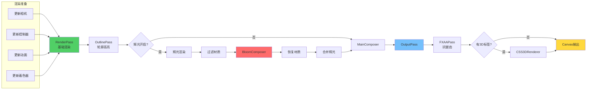

---

## 🎯 功能模块图

### 1. 材质系统架构

```mermaid
graph TB
    MatSystem[材质系统]

    subgraph "材质类型"
        MT1[MeshBasicMaterial]
        MT2[MeshLambertMaterial]
        MT3[MeshPhongMaterial]
        MT4[MeshStandardMaterial]
        MT5[MeshPhysicalMaterial]
        MT6[MeshToonMaterial]
        MT7[MeshMatcapMaterial]
        MT8[Default Material]
    end

    subgraph "材质属性"
        MA1[color 颜色]
        MA2[opacity 透明度]
        MA3[wireframe 线框]
        MA4[depthWrite 深度写入]
        MA5[side 面]
        MA6[transparent 透明]
    end

    subgraph "贴图管理"
        TX1[map 基础贴图]
        TX2[normalMap 法线]
        TX3[roughnessMap 粗糙度]
        TX4[metalnessMap 金属度]
        TX5[emissiveMap 发光]
    end

    subgraph "操作功能"
        OP1[选择材质]
        OP2[修改属性]
        OP3[切换类型]
        OP4[加载贴图]
        OP5[批量应用]
        OP6[重置材质]
    end

    MatSystem --> MT1 & MT2 & MT3 & MT4 & MT5 & MT6 & MT7 & MT8
    MatSystem --> MA1 & MA2 & MA3 & MA4 & MA5 & MA6
    MatSystem --> TX1 & TX2 & TX3 & TX4 & TX5
    MatSystem --> OP1 & OP2 & OP3 & OP4 & OP5 & OP6
```

### 2. 灯光系统架构

```mermaid
mindmap
  root((灯光系统))
    环境光 AmbientLight
      基础属性
        颜色 color
        强度 intensity
        启用 enabled
      操作
        创建
        更新
        删除
    平行光 DirectionalLight
      基础属性
        颜色 color
        强度 intensity
        位置 position
      阴影
        castShadow
        shadow.mapSize
        shadow.camera
      辅助
        DirectionalLightHelper
        helper.visible
      操作
        创建
        更新位置
        更新参数
        切换辅助线
    点光源 PointLight
      基础属性
        颜色 color
        强度 intensity
        距离 distance
        衰减 decay
      位置
        position.x
        position.y
        position.z
      辅助
        PointLightHelper
      操作
        创建
        更新
        移动
    聚光灯 SpotLight
      基础属性
        颜色 color
        强度 intensity
        角度 angle
      特殊属性
        半影 penumbra
        聚焦 focus
        距离 distance
      目标
        target.position
        lookAt
      阴影
        castShadow
        shadow配置
      辅助
        SpotLightHelper
```

### 3. 动画系统架构

```mermaid
graph TB
    AnimSystem[动画系统]

    subgraph "动画播放器"
        Player1[AnimationMixer]
        Player2[AnimationAction]
        Player3[AnimationClip]
    end

    subgraph "播放控制"
        Ctrl1[play 播放]
        Ctrl2[pause 暂停]
        Ctrl3[stop 停止]
        Ctrl4[reset 重置]
    end

    subgraph "动画配置"
        Cfg1[loop 循环模式]
        Cfg2[timeScale 播放速度]
        Cfg3[weight 权重]
        Cfg4[clampWhenFinished]
    end

    subgraph "轴旋转动画"
        Rot1[X轴旋转]
        Rot2[Y轴旋转]
        Rot3[Z轴旋转]
        Rot4[rotationSpeed]
    end

    subgraph "动画混合"
        Mix1[多动画混合]
        Mix2[动画过渡]
        Mix3[动画权重]
    end

    AnimSystem --> Player1 & Player2 & Player3
    AnimSystem --> Ctrl1 & Ctrl2 & Ctrl3 & Ctrl4
    AnimSystem --> Cfg1 & Cfg2 & Cfg3 & Cfg4
    AnimSystem --> Rot1 & Rot2 & Rot3 & Rot4
    AnimSystem --> Mix1 & Mix2 & Mix3

    style AnimSystem fill:#ff6b6b,stroke:#333,stroke-width:3px
```

---

## 🎨 编辑器功能全景图

### 完整功能树状图

```mermaid
mindmap
  root((3D模型编辑器))
    模型管理
      加载
        单模型
        多模型
        外部上传
        进度监控
      操作
        切换
        选择
        删除
        复制
      导出
        GLB
        GLTF
        USDZ
        封面截图
    背景系统
      类型
        纯色
        图片
        全景图
        HDR
        视频
      配置
        强度
        模糊度
        环境映射
    材质系统
      类型
        Basic
        Lambert
        Phong
        Standard
        Physical
        Toon
        Matcap
      属性
        颜色
        透明度
        线框
        深度写入
      贴图
        基础贴图
        法线贴图
        粗糙度贴图
        金属度贴图
    灯光系统
      环境光
        颜色
        强度
      平行光
        颜色强度
        位置
        阴影
        辅助线
      点光源
        颜色强度
        位置距离
        辅助线
      聚光灯
        颜色强度
        角度
        半影
        阴影辅助线
    动画系统
      播放器
        播放
        暂停
        停止
      配置
        循环模式
        速度
        权重
      轴旋转
        X/Y/Z轴
        速度控制
    后期效果
      辉光
        阈值
        强度
        半径
        颜色
      模型分解
        圆形分解
        自定义分解
        动画过渡
      材质拖拽
        平移
        旋转
        缩放
      其他
        轮廓高亮
        抗锯齿
        色调映射
    辅助工具
      网格辅助线
        大小
        分段
        颜色
        位置
      坐标轴
        大小
        显隐
      平面
        大小
        颜色
        阴影
    几何体系统
      类型
        Box
        Sphere
        Cylinder
        Cone
        Torus
        Plane
      操作
        拖拽创建
        参数编辑
        位置调整
        删除
    3D标签系统
      创建
        拖拽定位
        射线检测
      编辑
        内容
        样式
        位置
      管理
        删除
        批量操作
    多模型系统
      加载
        拖拽添加
        自动定位
      管理
        选择
        删除
        批量
      变换
        位置
        旋转
        缩放
    着色器系统
      预设
        警告着色器
        罗盘着色器
        雷达着色器
        光圈着色器
        墙体着色器
        闪烁警告
        圆圈围栏
      管理
        拖拽创建
        参数编辑
        缓存优化
    拖拽系统
      类型
        模型拖拽
        几何体拖拽
        标签拖拽
        着色器拖拽
        模型库拖拽
      核心
        拖拽引擎
        状态管理
        事件系统
      工具
        位置计算
        射线检测
        约束管理
        动画效果
    交互功能
      选择
        单选
        多选
        框选
      菜单
        右键菜单
        上下文操作
      快捷键
        Delete删除
        Ctrl+Z撤销
        Ctrl+Y重做
        其他快捷键
      鼠标
        点击
        双击
        悬停
        滚轮
```

---

## 📈 性能优化图

### 1. 渲染性能优化

```mermaid
flowchart TB
    Start([渲染请求]) --> Check{优化检查}

    Check --> Frustum[视锥体剔除]
    Frustum --> NotVisible[移除不可见对象]

    NotVisible --> LOD{LOD检查}
    LOD --> SelectLOD[选择合适的细节层次]

    SelectLOD --> Instance{实例化检查}
    Instance -->|多个相同对象| UseInstanced[使用InstancedMesh]
    Instance -->|单个对象| NormalMesh[普通Mesh]

    UseInstanced & NormalMesh --> Material{材质检查}
    Material --> ShareMaterial[材质复用]

    ShareMaterial --> Geometry{几何体检查}
    Geometry --> MergeGeometry[几何体合并]

    MergeGeometry --> Texture{纹理检查}
    Texture --> CompressTexture[纹理压缩KTX2]

    CompressTexture --> Render[执行渲染]

    Render --> PostProcess{后期处理}
    PostProcess -->|开启辉光| BloomRender[辉光渲染]
    PostProcess -->|关闭辉光| DirectRender[直接渲染]

    BloomRender & DirectRender --> Output[输出到Canvas]

    Output --> RAF[requestAnimationFrame]
    RAF --> Start

    style Start fill:#ffd93d
    style Render fill:#51cf66
    style Output fill:#74c0fc
```

### 2. 内存优化策略

```mermaid
graph TB
    Memory[内存优化]

    subgraph "Three.js对象"
        T1[shallowRef存储<br/>避免深度响应式]
        T2[及时dispose<br/>释放GPU资源]
        T3[对象池<br/>复用对象]
    end

    subgraph "贴图资源"
        TX1[纹理压缩]
        TX2[Mipmaps生成]
        TX3[按需加载]
        TX4[缓存策略]
    end

    subgraph "模型资源"
        M1[DRACO压缩]
        M2[几何体简化]
        M3[LOD层次]
        M4[懒加载]
    end

    subgraph "Vue响应式"
        V1[shallowReactive]
        V2[markRaw标记]
        V3[避免深度watch]
    end

    Memory --> T1 & T2 & T3
    Memory --> TX1 & TX2 & TX3 & TX4
    Memory --> M1 & M2 & M3 & M4
    Memory --> V1 & V2 & V3

    style Memory fill:#ff6b6b,stroke:#333,stroke-width:3px
```

---

## 🔧 服务架构图

### 1. 服务层架构

```mermaid
graph TB
    subgraph "Three.js Services"
        TS1[LoaderService<br/>加载服务]
        TS2[ExporterService<br/>导出服务]
        TS3[HelperService<br/>辅助服务]
    end

    subgraph "Storage Services"
        SS1[LocalStorageService<br/>本地存储]
        SS2[SessionStorageService<br/>会话存储]
        SS3[IndexedDBService<br/>数据库服务]
        SS4[CacheService<br/>缓存服务]
    end

    subgraph "Event Services"
        ES1[EventBus<br/>事件总线]
        ES2[EventEmitter<br/>事件发射器]
    end

    subgraph "API Services"
        AS1[ModelAPIService]
        AS2[ResourceAPIService]
    end

    TS1 --> TS3
    TS2 --> TS3

    SS1 --> SS4
    SS2 --> SS4
    SS3 --> SS4

    ES1 --> ES2

    style TS1 fill:#51cf66
    style SS1 fill:#74c0fc
    style ES1 fill:#ffd93d
    style AS1 fill:#ff9ff3
```

### 2. 事件系统架构

```mermaid
graph LR
    subgraph "事件发布者"
        EP1[Composables]
        EP2[Stores]
        EP3[Services]
    end

    EventBus[EventBus<br/>类型化事件总线]

    subgraph "事件类型"
        ET1[SceneEvents<br/>场景事件]
        ET2[DragEvents<br/>拖拽事件]
        ET3[EditorEvents<br/>编辑器事件]
        ET4[SelectionEvents<br/>选择事件]
        ET5[HistoryEvents<br/>历史事件]
    end

    subgraph "事件订阅者"
        ES1[Components]
        ES2[Composables]
        ES3[Stores]
    end

    EP1 & EP2 & EP3 --> EventBus
    EventBus --> ET1 & ET2 & ET3 & ET4 & ET5
    ET1 & ET2 & ET3 & ET4 & ET5 --> ES1 & ES2 & ES3

    style EventBus fill:#ff6b6b,stroke:#333,stroke-width:4px
```

---

## 📦 打包部署图

### 1. 构建流程

```mermaid
flowchart LR
    Source[源代码] --> Vite{Vite构建}

    Vite --> TypeCheck[类型检查<br/>vue-tsc]
    Vite --> Lint[代码检查<br/>ESLint]
    Vite --> Build[打包构建]

    TypeCheck --> Pass1{通过?}
    Lint --> Pass2{通过?}

    Pass1 -->|是| Continue1
    Pass1 -->|否| Error1[中止构建]

    Pass2 -->|是| Continue2
    Pass2 -->|否| Error2[中止构建]

    Continue1 & Continue2 --> Build

    Build --> Optimize[优化]

    Optimize --> TreeShake[Tree Shaking]
    Optimize --> CodeSplit[代码分割]
    Optimize --> Compress[压缩]
    Optimize --> MinifyCSS[CSS压缩]

    TreeShake & CodeSplit & Compress & MinifyCSS --> Output[输出dist/]

    Output --> Chunks[chunks/]
    Output --> Assets[assets/]
    Output --> Index[index.html]

    style Vite fill:#646cff
    style Build fill:#51cf66
    style Output fill:#ffd93d
```

### 2. 部署架构

```mermaid
graph TB
    Git[Git Repository] --> CI[CI/CD Pipeline]

    CI --> Test[运行测试]
    Test --> Build[构建生产版本]
    Build --> Deploy[部署]

    Deploy --> Static[静态资源服务器]
    Deploy --> CDN[CDN分发]

    Static --> HTML[index.html]
    CDN --> JS[JavaScript Chunks]
    CDN --> CSS[CSS文件]
    CDN --> Assets[图片/模型/着色器]

    HTML --> Browser[浏览器]
    JS --> Browser
    CSS --> Browser
    Assets --> Browser

    Browser --> LoadApp[加载应用]
    LoadApp --> InitVue[初始化Vue]
    InitVue --> InitThree[初始化Three.js]
    InitThree --> Ready[应用就绪]

    style CI fill:#ff6b6b
    style Deploy fill:#51cf66
    style Browser fill:#74c0fc
    style Ready fill:#ffd93d
```

---

## 🎯 用户交互图

### 完整用户操作流程

```mermaid
journey
    title 用户使用3D编辑器的典型流程
    section 启动
      打开编辑器: 5: 用户
      加载默认模型: 3: 系统
      初始化场景: 3: 系统
    section 编辑
      选择编辑模式: 5: 用户
      切换模型: 4: 用户
      调整材质: 5: 用户
      设置灯光: 4: 用户
      添加标签: 4: 用户
    section 高级
      拖拽多模型: 5: 用户
      启用辉光效果: 5: 用户
      添加着色器: 4: 用户
      模型分解: 5: 用户
    section 导出
      预览效果: 5: 用户
      保存配置: 4: 用户
      导出模型: 5: 用户
      生成嵌入代码: 4: 用户
```

---

## 📊 性能监控图

### 性能指标仪表板

```mermaid
graph TB
    Monitor[性能监控]

    subgraph "渲染性能"
        R1[FPS<br/>目标: >60]
        R2[渲染时间<br/>目标: <16ms]
        R3[Draw Calls<br/>目标: <100]
    end

    subgraph "内存使用"
        M1[堆内存<br/>目标: <200MB]
        M2[GPU内存<br/>目标: <512MB]
        M3[纹理内存<br/>目标: <100MB]
    end

    subgraph "加载性能"
        L1[首屏时间<br/>目标: <3s]
        L2[模型加载<br/>目标: <5s]
        L3[资源加载<br/>目标: <2s]
    end

    subgraph "用户体验"
        U1[交互响应<br/>目标: <100ms]
        U2[拖拽流畅度<br/>目标: 60fps]
        U3[切换延迟<br/>目标: <200ms]
    end

    Monitor --> R1 & R2 & R3
    Monitor --> M1 & M2 & M3
    Monitor --> L1 & L2 & L3
    Monitor --> U1 & U2 & U3

    style Monitor fill:#ff6b6b,stroke:#333,stroke-width:3px
    style R1 fill:#51cf66
    style M1 fill:#74c0fc
    style L1 fill:#ffd93d
    style U1 fill:#ff9ff3
```

---

## 🔐 安全架构图

### 数据安全与验证

```mermaid
graph TB
    Input[用户输入] --> Validation{数据验证}

    Validation -->|文件上传| FileCheck[文件类型检查]
    Validation -->|参数输入| ParamCheck[参数范围检查]
    Validation -->|拖拽操作| DragCheck[位置有效性检查]

    FileCheck --> SizeLimit{大小限制}
    SizeLimit -->|超限| Reject1[拒绝]
    SizeLimit -->|通过| TypeCheck{类型检查}
    TypeCheck -->|不支持| Reject2[拒绝]
    TypeCheck -->|支持| Accept1[接受]

    ParamCheck --> RangeCheck{范围检查}
    RangeCheck -->|超出范围| Reject3[拒绝]
    RangeCheck -->|合法| Accept2[接受]

    DragCheck --> RaycastCheck{射线检测}
    RaycastCheck -->|无效位置| Reject4[警告]
    RaycastCheck -->|有效| Accept3[接受]

    Accept1 & Accept2 & Accept3 --> Sanitize[数据清理]
    Sanitize --> Store[存储到Store]

    Reject1 & Reject2 & Reject3 & Reject4 --> ShowError[显示错误提示]

    style Input fill:#ffd93d
    style Validation fill:#74c0fc
    style Store fill:#51cf66
    style ShowError fill:#ff6b6b
```

---

## 🎨 主题与样式架构

### UI主题系统

```mermaid
graph LR
    Theme[主题系统]

    subgraph "颜色变量"
        C1[--primary-color]
        C2[--bg-color]
        C3[--text-color]
        C4[--border-color]
        C5[--hover-color]
    end

    subgraph "组件样式"
        S1[Toolbar样式]
        S2[Panel样式]
        S3[Canvas样式]
        S4[Button样式]
    end

    subgraph "主题模式"
        M1[Light Mode]
        M2[Dark Mode]
    end

    Theme --> C1 & C2 & C3 & C4 & C5
    C1 & C2 & C3 & C4 & C5 --> S1 & S2 & S3 & S4
    M1 & M2 --> Theme

    style Theme fill:#ff6b6b,stroke:#333,stroke-width:3px
```

---

## 🎯 总结图

### 架构演进对比

```mermaid
timeline
    title 架构演进时间线
    section 原架构
        JavaScript : 无类型安全
        Options API : 代码组织性差
        单一类 : renderModel 976行
        状态分散 : 3处不同位置
        拖拽混乱 : 5+个文件分散
    section 新架构
        TypeScript : 100%类型覆盖
        Composition API : script setup语法
        模块化 : 84个Composables
        统一状态 : 13个Pinia Stores
        拖拽系统 : 15个模块统一架构
```

### 最终架构价值图

```mermaid
mindmap
  root((架构价值))
    开发效率
      代码提示完善
      类型检查自动
      热更新快速
      开发体验优秀
    代码质量
      模块化清晰
      职责单一
      可读性强
      可维护性高
    系统性能
      渲染优化
      内存优化
      加载优化
      交互流畅
    团队协作
      易于理解
      易于测试
      易于扩展
      易于维护
    商业价值
      开发成本降低
      维护成本降低
      Bug率降低
      用户体验提升
```

---

## 📝 图表索引

本文档包含的所有图表:

| 图表编号 | 图表名称         | 类型       | 作用                |
| -------- | ---------------- | ---------- | ------------------- |
| 1.1      | 系统上下文图     | C4 Context | 展示系统边界        |
| 1.2      | 六层架构全景     | 架构图     | 展示分层架构        |
| 2.1      | Composables生态  | 模块图     | 展示Composables关系 |
| 2.2      | Pinia Stores架构 | 依赖图     | 展示Store依赖       |
| 3.1      | 拖拽系统架构     | 架构图     | 展示拖拽模块        |
| 3.2      | 拖拽类型流程     | 状态图     | 展示拖拽状态机      |
| 3.3      | 拖拽交互时序     | 时序图     | 展示交互流程        |
| 4.1      | 完整数据流       | 流程图     | 展示数据流向        |
| 4.2      | 状态更新流程     | 时序图     | 展示状态更新        |
| 5.1      | Composables依赖  | 依赖图     | 展示模块依赖        |
| 5.2      | Store依赖关系    | 依赖图     | 展示Store依赖       |
| 6.1      | 模型加载流程     | 流程图     | 展示加载过程        |
| 6.2      | 材质编辑流程     | 流程图     | 展示编辑过程        |
| 6.3      | 辉光渲染流程     | 流程图     | 展示渲染过程        |
| 7.1      | 组件层次树       | 树形图     | 展示组件结构        |
| 7.2      | 编辑面板关系     | 关系图     | 展示面板组成        |
| 8.1      | 场景对象层次     | 树形图     | 展示Three.js场景    |
| 8.2      | 渲染管线         | 流程图     | 展示渲染流程        |
| 9.1      | 材质系统         | 架构图     | 展示材质模块        |
| 9.2      | 灯光系统         | 思维导图   | 展示灯光功能        |
| 9.3      | 动画系统         | 架构图     | 展示动画模块        |
| 10.1     | 功能树状图       | 思维导图   | 展示所有功能        |
| 11.1     | 渲染优化         | 流程图     | 展示优化策略        |
| 11.2     | 内存优化         | 架构图     | 展示内存管理        |
| 12.1     | 服务层架构       | 架构图     | 展示服务模块        |
| 12.2     | 事件系统         | 架构图     | 展示事件流          |
| 13.1     | 构建流程         | 流程图     | 展示构建过程        |
| 13.2     | 部署架构         | 架构图     | 展示部署流程        |
| 14.1     | 用户旅程         | Journey    | 展示用户流程        |
| 15.1     | 性能监控         | 仪表板     | 展示性能指标        |
| 16.1     | 安全验证         | 流程图     | 展示安全流程        |
| 17.1     | 主题系统         | 架构图     | 展示主题管理        |
| 18.1     | 架构演进         | 时间线     | 展示演进过程        |
| 18.2     | 架构价值         | 思维导图   | 展示核心价值        |

**总计**: 32个可视化图表

---

## 🎯 如何使用本文档

### 不同角色的阅读建议

| 角色             | 推荐图表             | 阅读重点              |
| ---------------- | -------------------- | --------------------- |
| **架构师**       | 1.1, 1.2, 2.1, 2.2   | 整体架构和模块设计    |
| **前端开发**     | 2.1, 5.1, 7.1, 10.1  | Composables和组件关系 |
| **Three.js开发** | 8.1, 8.2, 9.1        | 场景结构和渲染流程    |
| **测试工程师**   | 6.1, 6.2, 14.1       | 功能流程和用户旅程    |
| **项目经理**     | 18.1, 18.2           | 架构演进和商业价值    |
| **新成员**       | 1.1, 1.2, 10.1, 14.1 | 系统全景和功能树      |

---

## 📝 总结

本文档通过**32个可视化图表**全方位展示了:

- ✅ 系统全景和分层架构
- ✅ 核心模块和依赖关系
- ✅ 拖拽系统完整设计
- ✅ 数据流和交互流程
- ✅ 组件结构和Three.js场景
- ✅ 各功能子系统详细设计
- ✅ 性能优化策略
- ✅ 部署和安全架构

**通过图形化的方式，让复杂的架构设计一目了然！**
