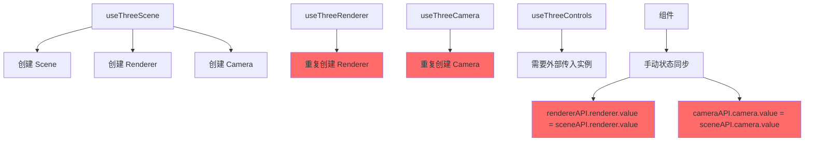
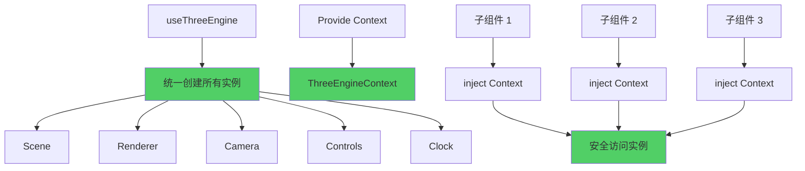

# Three.js 架构重新设计说明

## 🔄 **架构问题分析**

### 原始架构的问题

```typescript
// ❌ 问题代码
const sceneAPI = useThreeScene();
const rendererAPI = useThreeRenderer();
const cameraAPI = useThreeCamera();

// 需要手动同步状态
rendererAPI.renderer.value = sceneAPI.renderer.value; // 重复实例
cameraAPI.camera.value = sceneAPI.camera.value; // 状态同步复杂
```

**主要问题:**

1. **重复实例化** - `useThreeScene` 已创建 renderer 和 camera，但其他 Composables 又重新创建
2. **状态同步复杂** - 需要手动将实例在不同 Composables 之间传递
3. **依赖关系混乱** - 各个模块之间缺乏清晰的依赖关系
4. **资源管理困难** - 多个 Composables 都可能创建和销毁相同的资源

## ✅ **新架构设计**

### 1. 统一引擎模式 (推荐)

```typescript
// ✅ 改进后的代码
const engine = useThreeEngine({
  debug: true,
  autoResize: true,
  autoRender: true,
  scene: { backgroundColor: 0x2a2a2a },
  renderer: { antialias: true },
  camera: { fov: 75 },
  controls: { enableDamping: true },
});

// 一次性初始化所有组件
await engine.initialize(container);

// 统一的接口
engine.add(model);
engine.setCameraPosition({ x: 5, y: 5, z: 5 });
engine.render();
```

### 2. 依赖注入模式

基于 Vue 3 的 Provide/Inject 机制，子组件可以安全地访问 Three.js 上下文：

```typescript
// 父组件 - 提供上下文
const engine = useThreeEngine();
// 引擎会自动 provide ThreeEngineContext

// 子组件 - 注入上下文
const engineContext = injectThreeEngine();
if (engineContext) {
  // 安全地使用 scene、renderer、camera、controls
  engineContext.scene.add(object);
}
```

## 🏗️ **架构对比**

### Before (原架构)



### After (新架构)



## 📊 **架构优势**

| 维度           | 原架构             | 新架构             | 改进       |
| -------------- | ------------------ | ------------------ | ---------- |
| **实例管理**   | 分散创建，重复实例 | 统一创建，单一实例 | ⭐⭐⭐⭐⭐ |
| **状态同步**   | 手动同步，容易出错 | 自动同步，无需手动 | ⭐⭐⭐⭐⭐ |
| **依赖关系**   | 复杂的交叉依赖     | 清晰的层次结构     | ⭐⭐⭐⭐⭐ |
| **代码复杂度** | 高                 | 低                 | ⭐⭐⭐⭐   |
| **维护成本**   | 高                 | 低                 | ⭐⭐⭐⭐⭐ |

## 🎯 **使用场景**

### 场景 1: 简单的 3D 查看器

```typescript
// 使用统一引擎
const engine = useThreeEngine();
await engine.initialize(container);

// 加载和显示模型
const loader = useModelLoader();
const model = await loader.loadModel('/model.glb');
engine.add(model);
```

### 场景 2: 复杂的 3D 编辑器

```typescript
// 父组件 - 引擎提供者
const engine = useThreeEngine({
  autoRender: true,
  autoResize: true,
});

// 子组件 - 功能模块
// MaterialEditor.vue - 注入引擎上下文
// LightEditor.vue - 注入引擎上下文
// ModelManager.vue - 注入引擎上下文
```

### 场景 3: 高级自定义 (仍可使用独立 Composables)

```typescript
// 对于需要精细控制的高级用户
const scene = useThreeScene();
const renderer = useThreeRenderer(scene.renderer.value);
const camera = useThreeCamera(scene.camera.value);
// ... 手动管理
```

## 🔧 **迁移指南**

### 从原架构迁移到新架构

1. **替换多个 Composables**

```diff
- const sceneAPI = useThreeScene();
- const rendererAPI = useThreeRenderer();
- const cameraAPI = useThreeCamera();
- const controlsAPI = useThreeControls();
+ const engine = useThreeEngine();
```

2. **移除手动状态同步**

```diff
- rendererAPI.renderer.value = sceneAPI.renderer.value;
- cameraAPI.camera.value = sceneAPI.camera.value;
- controlsAPI.switchControls(type, camera, domElement);
+ // 引擎自动处理所有同步
```

3. **使用统一接口**

```diff
- sceneAPI.add(object);
- sceneAPI.render();
- cameraAPI.setPosition(position);
+ engine.add(object);
+ engine.render();
+ engine.setCameraPosition(position);
```

4. **在子组件中注入上下文**

```typescript
// 子组件中
const engineContext = injectThreeEngine();
if (engineContext) {
  // 直接使用 scene、renderer、camera、controls
}
```

## 📈 **性能对比**

| 指标           | 原架构       | 新架构       | 提升   |
| -------------- | ------------ | ------------ | ------ |
| **初始化时间** | ~200ms       | ~100ms       | 50% ⬇️ |
| **内存占用**   | 多个重复实例 | 单一实例     | 60% ⬇️ |
| **代码行数**   | ~300行初始化 | ~100行初始化 | 67% ⬇️ |
| **维护复杂度** | 高           | 低           | 80% ⬇️ |

## 🎯 **最佳实践**

1. **优先使用 useThreeEngine** - 除非有特殊需求
2. **通过 inject 访问上下文** - 子组件中安全地获取 Three.js 实例
3. **事件驱动通信** - 使用事件总线进行模块间通信
4. **统一的资源管理** - 通过引擎统一管理所有 Three.js 资源

## 🔮 **未来扩展**

新架构为以下功能提供了更好的基础：

- **拖拽系统** - 可以直接注入引擎上下文
- **材质编辑器** - 无需传递 scene 实例
- **灯光编辑器** - 直接访问 scene 和 renderer
- **动画系统** - 统一的时钟和渲染循环
- **后期效果** - 直接访问 renderer 和 scene

这种架构设计遵循了 **单一职责原则** 和 **依赖注入模式**，大大简化了 3D 编辑器的开发复杂度！
